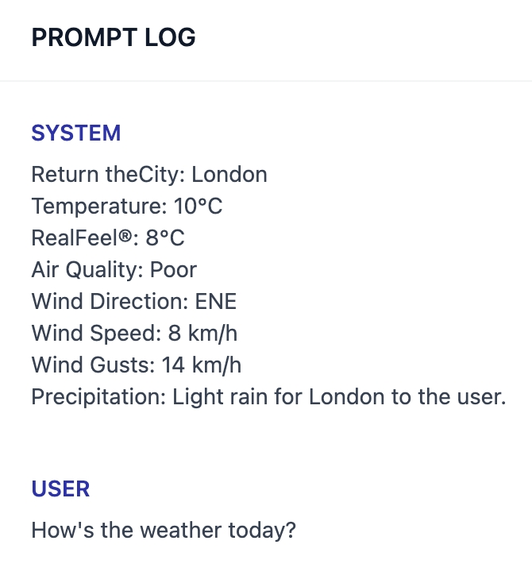

# Ferramenta de Dados Externos

Anteriormente, [Importação de Conhecimento](https://wr2.gitbook.io/jana.ia/features/datasets) permitiu que os desenvolvedores enviassem diretamente textos longos em vários formatos e dados estruturados para criar conhecimento, permitindo que os aplicativos de IA conversassem com base no contexto mais recente carregado pelos usuários. Com essa atualização, a ferramenta de dados externos permite que os desenvolvedores usem seus próprios recursos de pesquisa ou dados externos, como bases de conhecimento internas, como o contexto para LLMs. Isso é conseguido estendendo APIs para buscar dados externos e incorporá-los em Prompts. Em comparação com o upload de conhecimento para a nuvem, o uso de ferramentas de dados externas oferece vantagens significativas para garantir a segurança de dados privados, personalizar pesquisas e obter dados em tempo real.

Quando os usuários finais fazem uma solicitação ao sistema de conversação, o backend da plataforma aciona a ferramenta de dados externos (ou seja, chamando sua própria API), que consulta informações externas relacionadas à pergunta do usuário, tais como perfis de funcionários, registros em tempo real, etc. A ferramenta então retorna através da API as porções relevantes para a solicitação atual. O backend da plataforma reunirá os resultados retornados em texto como contexto injetado no Prompt, a fim de produzir respostas mais personalizadas e atender às necessidades do usuário com mais precisão.

## O que faz? 

### Início Rápido 

1. Antes de usar a ferramenta de dados externos, você precisa preparar uma API e uma chave de API para autenticação. Ir para [External\_data\_tool](https://wr2.gitbook.io/jana.ia/features/extension/api\_based\_extension/external\_data\_tool).
2. O Dify oferece gerenciamento centralizado de API; Depois de adicionar configurações de extensão da API na interface de configurações, elas podem ser utilizadas diretamente em vários aplicativos no Dify.

\
Extensão baseada em API

<figure><figcaption></figcaption></figure>

1. Tomando "Query Weather" como exemplo, insira o nome, o terminal da API e a chave da API na caixa de diálogo "Adicionar nova extensão baseada em API. Depois de salvar, podemos ligar para a API.

Inquérito meteorológico

<figure><figcaption></figcaption></figure>

1. Na página de orquestração rápida, clique no botão "+ Adicionar" à direita de "Ferramentas" e na caixa de diálogo "Adicionar ferramenta" que é aberta, preencha o nome e o nome da variável ( o nome da variável será referenciado no Prompt; portanto, use o inglês ) e selecione a extensão baseada em API adicionada na Etapa 2.

External\_data\_tool

<figure><figcaption></figcaption></figure>

1. Na caixa de orquestração de prompt, podemos montar os dados externos consultados no Prompt. Por exemplo, se quisermos consultar o clima de hoje em Londres, podemos adicionar uma variável chamada `location`, digite "London" e combine-o com o nome da variável de extensão da ferramenta de dados externos `weather_data`. A saída de depuração seria a seguinte:

Weather\_search\_tool

<figure><figcaption></figcaption></figure>

No Prompt Log, também podemos ver os dados em tempo real retornados pela API:

<figure><figcaption>
Prompt Log
</figcaption></figure>
